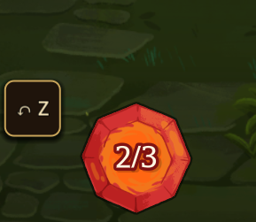

# StS2 Undo

A **Slay the Spire 2** mod that lets you undo card plays and turns during combat.

> Misclicked a card? Played a power in the wrong order? Just press **Z**.



[한국어 README](README.ko.md)

**Nexus Mods:** https://www.nexusmods.com/slaythespire2/mods/716

---

## Features

- **Undo a single card play** with `Z`
- **Undo an entire turn** with `Shift+Z` — rewinds to the start of the current player turn
- **In-combat undo button** next to the energy display (mirrors the `Z` hotkey)
- Works only inside an active combat — *no undo after death, no undo on the map*
- Up to **30 snapshots** retained per combat
- **Singleplayer only** — the manifest declares `"affects_gameplay": true`, so the
  game's mod loader disables this mod in multiplayer sessions. Don't try to use
  it in co-op; the rewind would desync from the other player's state.

## How it works

The mod takes a **deep snapshot of the combat state** the moment any of these actions begin:

- Card play (`PlayCardAction`)
- End turn (`EndPlayerTurnAction`)
- Use / discard potion (`UsePotionAction`, `DiscardPotionGameAction`)

Pressing `Z` pops the most recent snapshot and restores HP, block, energy, hand/draw/discard/exhaust piles, powers, relics, potions, orbs, monster intents, RNG, and visual state (spine animations, modulate, hitboxes, etc.).

This is a **snapshot approach**, not a command/inverse-op approach — picking the inverse of every status interaction in StS2 is not realistic, so it captures-and-restores instead.

## Hotkeys

| Key       | Action                                |
|-----------|---------------------------------------|
| `Z`       | Undo one step (last card / potion / end-turn) |
| `Shift+Z` | Undo to the start of the current turn |

You can also click the `↶ Z` button that appears near the energy display.
**Right-click and drag** the button to move it; the position is saved to
`%APPDATA%\Sts2UndoMod\settings.json` (Windows) and applied on the next
combat. Delete that file to reset the position to default.

## Installation

1. Download the latest release `Sts2UndoMod.dll` and `Sts2UndoMod.json` from
   [Nexus Mods](https://www.nexusmods.com/slaythespire2/mods/716) or
   [GitHub Releases](../../releases).
2. Copy both files into:
   ```
   <Slay the Spire 2 install>/mods/Sts2UndoMod/
   ```
3. Launch the game.

> **Stable vs beta branch:** two builds are published per version —
> `Sts2UndoMod-vX.Y.Z.zip` for the **stable** branch (STS2 v0.103.x) and
> `Sts2UndoMod-vX.Y.Z-beta.zip` for the **beta opt-in** branch (STS2
> v0.104.0+, currently v0.106.x). Download the one matching your branch
> (Steam → Slay the Spire 2 → Properties → Betas). Running the wrong build
> throws `MissingMethodException` on the first card play, because the STS2
> API differs between branches.

## Building from source

Requirements:
- .NET SDK 9.0
- Godot.NET.Sdk 4.5.1 (resolved automatically via `Directory.Build.props`)
- A local Slay the Spire 2 install (auto-detected via Steam registry / standard paths by `Sts2PathDiscovery.props`)

```sh
dotnet build Sts2UndoMod.csproj -c Release
```

The build copies `Sts2UndoMod.dll` and `Sts2UndoMod.json` into `<sts2>/mods/Sts2UndoMod/` automatically (`CopyToModsFolderOnBuild` target).

## Logs

The mod writes a log to:
```
%APPDATA%/Sts2UndoMod/probe.log   (Windows)
~/.config/Sts2UndoMod/probe.log   (Linux/macOS)
```
Attach this when reporting issues.

## Changelog

Full notes on [GitHub Releases](../../releases).

- **v0.0.12** — Fixed a duplicate-undo bug where one card play required two
  presses of `Z` (the snapshot-dedup gate probed a non-existent
  `ActionExecutor` field, so every manual play snapshotted twice). Also
  fixed a per-card-play stutter on relic-heavy runs by removing a redundant
  relic deep-clone from the capture hot path.
- **v0.0.10** — Multiplayer auto-dormant, instanced-power (Orbit) undo
  fidelity, and sibling-mod ([Sts2CombatAI](https://github.com/ing-gom/sts2-combat-ai))
  AI auto-play coverage.

## Credits

This mod stands on the shoulders of earlier work. Big thanks to:

- **JiesiLuo** — author of [`UndoAndRedo`](https://github.com/luojiesi/SLS2Mods)
  for Slay the Spire 2, the direct predecessor this mod is built on. The
  combat-state snapshot architecture and much of the groundwork comes from
  that project.
- **filippobaroni** — author of
  [`Undo the Spire`](https://github.com/filippobaroni/undo-the-spire) for
  Slay the Spire 1, which originated the core idea of full combat-state
  snapshots for undo.
- **MegaCrit** — for Slay the Spire 2.
- **HarmonyX** — runtime patching library used by this mod (bundled with
  the game; not redistributed here).

## License

[MIT](LICENSE).
